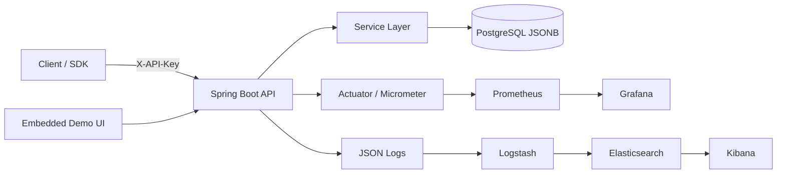

<h1 align="center">Smart Activity Tracker</h1>

<p align="center">
  
</p>

<p align="center">
  Backend-сервис на Spring Boot с production-oriented подходом для приёма пользовательских событий, идемпотентного хранения и продуктовой аналитики.
</p>

Проект оформлен как полноценный бэкенд-проект для портфолио: API-ключи, JSONB-метаданные, пакетный приём событий, пагинация, продвинутая аналитика, метрики Prometheus/Grafana, ELK-логирование, Testcontainers и операционная документация.

<h2 align="center">Ключевые возможности</h2>

- Модель проектов и API-ключей, привязанных к проектам.
- Безопасное хранение API-ключей: в БД сохраняются только SHA-256 hash-значения.
- Приём одиночных и пакетных событий через `X-API-Key`.
- Идемпотентность через `unique(project_id, event_id)`.
- JSONB-метаданные и фильтрация по metadata-полям.
- Поиск событий по проекту, пользователю, типу, источнику, сессии, диапазону времени и metadata.
- Аналитика: DAU, WAU, MAU, retention, cohorts, funnels, sessions, top users и top event types.
- Метрики Micrometer для приёма событий, дублей, отклонённых событий, использования API-ключей и latency аналитики.
- Структурированные JSON-логи с `requestId` / `correlationId` и пайплайном Logstash -> Elasticsearch -> Kibana.
- Встроенная demo UI-панель для проектов, ключей, приёма событий, фильтров и аналитических виджетов.
- Flyway migrations, OpenAPI/Swagger, Docker Compose и Testcontainers.

<h2 align="center">Архитектура</h2>



<h2 align="center">Технологический стек</h2>

Java 17, Spring Boot 3.2, Maven, PostgreSQL, Flyway, Spring Data JPA, Bean Validation, Micrometer, Prometheus, Grafana, Elasticsearch, Logstash, Kibana, OpenAPI/Swagger, Testcontainers, JUnit 5, Mockito, Docker Compose.

<h2 align="center">Быстрый запуск</h2>

```bash
docker compose -f ops/docker-compose.yml up -d --build
```

Локальные адреса:

- Приложение / UI: `http://localhost:8080`
- Swagger: `http://localhost:8080/swagger-ui/index.html`
- PostgreSQL: `localhost:5433`
- Prometheus: `http://localhost:9090`
- Grafana: `http://localhost:3000` (`admin` / `admin`)
- Elasticsearch: `http://localhost:9200`
- Kibana: `http://localhost:5601`

Переменные окружения перечислены в `.env.example`.

<h2 align="center">Пример основного сценария</h2>

```bash
PROJECT_ID=$(curl -sS -X POST http://localhost:8080/api/v1/projects \
  -H 'Content-Type: application/json' \
  -d '{"name":"Demo Project","slug":"demo-project"}' | jq -r '.id')

API_KEY=$(curl -sS -X POST "http://localhost:8080/api/v1/projects/$PROJECT_ID/api-keys" \
  -H 'Content-Type: application/json' \
  -d '{"name":"local-demo"}' | jq -r '.secret')

curl -sS -X POST http://localhost:8080/api/v1/events \
  -H 'Content-Type: application/json' \
  -H "X-API-Key: $API_KEY" \
  -d '{"eventId":"evt-001","userId":"user-42","type":"purchase","source":"web","metadata":{"country":"DE","device":"mobile"}}'

curl -sS "http://localhost:8080/api/v1/events?projectId=$PROJECT_ID&type=purchase&metadata.country=DE"
```

<h2 align="center">Примеры аналитики</h2>

```bash
curl -sS "http://localhost:8080/api/v1/analytics/dau?projectId=1&from=2026-02-01T00:00:00Z&to=2026-03-01T00:00:00Z"
curl -sS "http://localhost:8080/api/v1/analytics/funnels?projectId=1&from=2026-02-01T00:00:00Z&to=2026-03-01T00:00:00Z&steps=landing_view,signup,purchase"
curl -sS "http://localhost:8080/api/v1/analytics/sessions?projectId=1&from=2026-02-01T00:00:00Z&to=2026-03-01T00:00:00Z"
```

<h2 align="center">Документация</h2>

- [Архитектура](docs/architecture.md)
- [Руководство по API](docs/api-guide.md)
- [Модель данных](docs/data-model.md)
- [Аналитика](docs/analytics.md)
- [Безопасность](docs/security.md)
- [Наблюдаемость](docs/observability.md)
- [Логирование](docs/logging.md)
- [Эксплуатация](docs/operations.md)
- [Тестирование](docs/testing.md)
- [Нагрузочное тестирование](docs/load-testing.md)
- [ADR](docs/decisions)

<h2 align="center">Тестирование</h2>

```bash
mvn test
```

Unit-тесты запускаются всегда. Integration-тесты на Testcontainers компилируются и запускаются при доступном Docker; в окружениях без совместимого Docker daemon они пропускаются автоматически.

<h2 align="center">Нагрузочное тестирование</h2>

```bash
API_KEY=sat_xxx BASE_URL=http://localhost:8080 k6 run load-tests/batch-ingest.js
PROJECT_ID=1 BASE_URL=http://localhost:8080 k6 run load-tests/analytics.js
```

Во время тестов смотри в Grafana метрики `events_batch_duration_seconds`, `events_ingested_total`, `events_duplicate_total` и `analytics_query_duration_seconds`.
