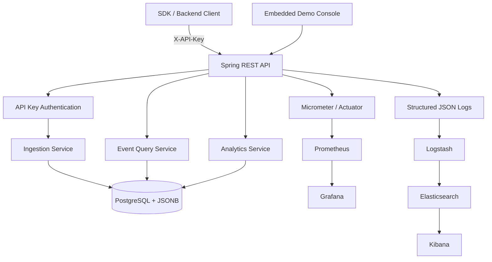
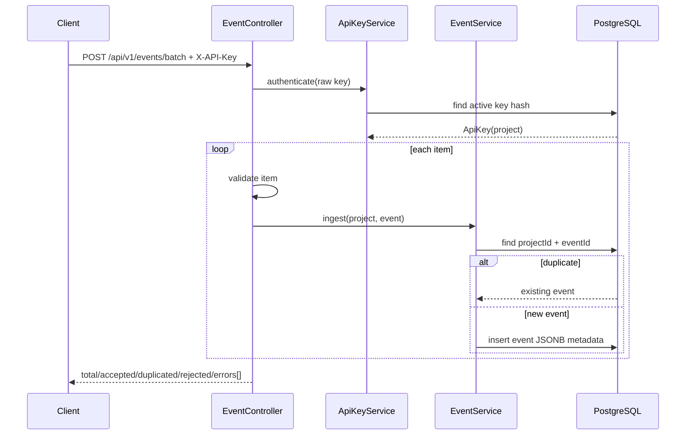
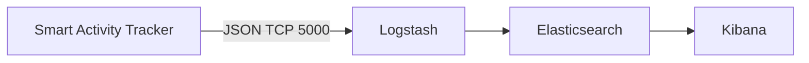

# Architecture

Smart Activity Tracker is a Spring Boot backend for project-scoped event ingestion, idempotent storage and product analytics.

## Components

- Controllers expose `/api/v1/projects`, `/api/v1/events` and `/api/v1/analytics`.
- Services own validation, idempotency, API key lifecycle and analytics calculations.
- Repositories use Spring Data JPA and PostgreSQL-specific JSONB functions where needed.
- Flyway owns every schema change.
- Micrometer exports operational counters, summaries and timers.
- Logback emits structured JSON to console and Logstash TCP input.

## Batch Ingestion Flow

## Logging Flow

