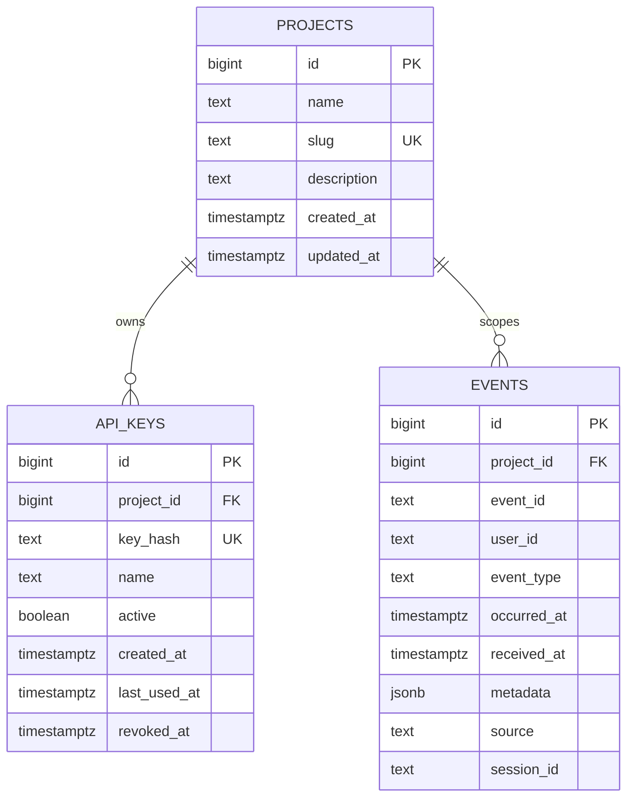

# Data Model

## Indexes

- `unique(project_id, event_id)` enforces idempotency per project.
- `(project_id, occurred_at)` supports time-range analytics.
- `(project_id, event_type)` supports funnels and top event types.
- `(project_id, user_id)` supports user timelines and retention.
- `GIN(metadata)` supports metadata-aware search.
- `(project_id, source)` and `(project_id, session_id)` support operational filters.

## API Keys

Only SHA-256 hashes are stored in `api_keys.key_hash`. Raw secrets are generated with `SecureRandom`, returned once and then discarded.
