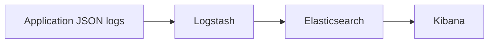

# Logging

The application writes structured JSON logs through Logback and sends them to Logstash over TCP port `5000`.

Log fields include timestamp, level, logger, thread, message, stack trace, requestId, correlationId, projectId and apiKeyId when available. `HttpLoggingFilter` records HTTP method, path, status and duration in the message arguments.

Example searches in Kibana:

- `message : "batch_ingestion_finished" and rejected > 0`
- `message : "api_key_auth_failed"`
- `message : "single_event_ingested" and duplicated : true`
- `message : "analytics_query_started"`

Troubleshooting:

1. Check Logstash health: `curl -sS http://localhost:9600`.
2. Check Elasticsearch indices: `curl -sS http://localhost:9200/_cat/indices/smart-activity-tracker-logs-*`.
3. Open Kibana at `http://localhost:5601` and create a data view for `smart-activity-tracker-logs-*`.
